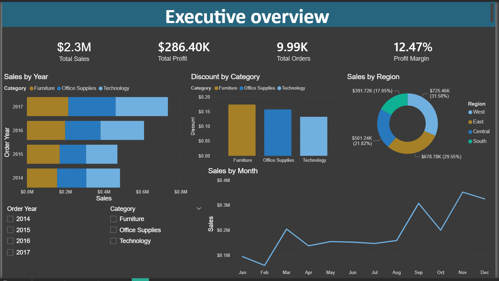
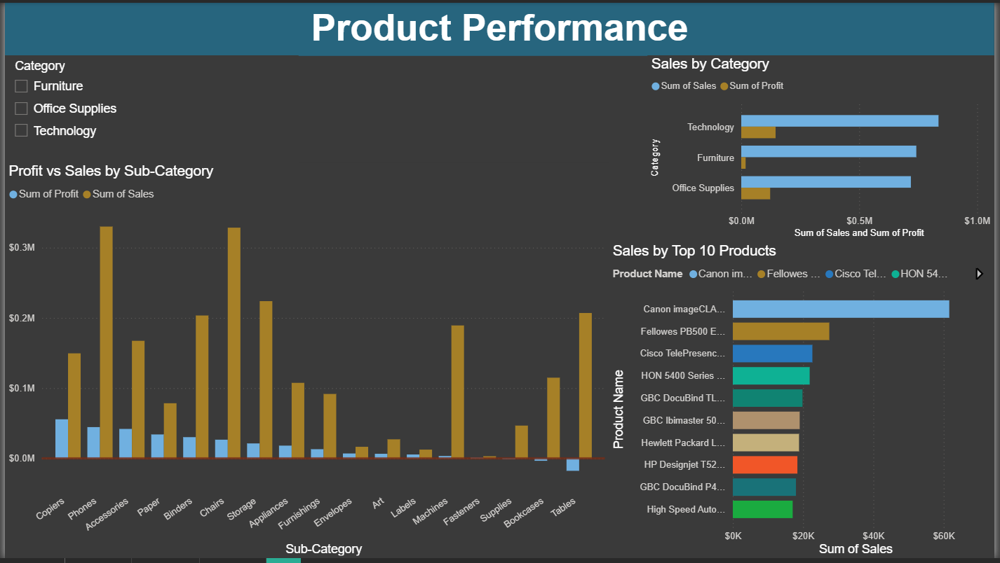
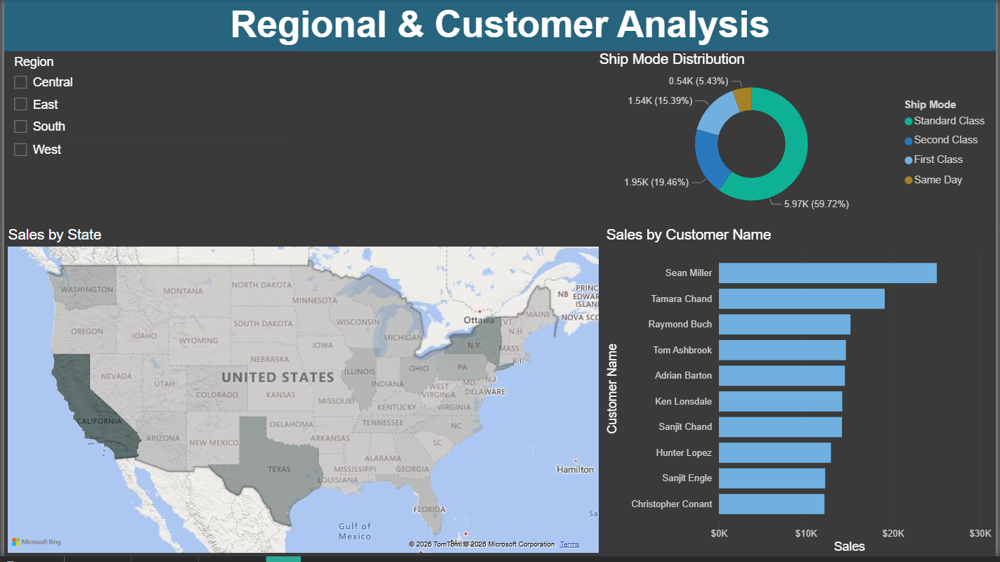

# Superstore Sales Analysis Dashboard

git clone https://github.com/Itzmemanish01/superstore-sales-analysis

## Project Overview
Analyzed 4 years of transactional sales data (2014–2017) across 9,994 orders and $2.3M in revenue to identify performance trends, profitable product categories, and regional sales patterns. Built an interactive 3-page Power BI dashboard for business stakeholders.

## Business Problem
The business needed visibility into which product categories, regions, 
and time periods were driving revenue and profit — and more importantly, 
which were losing money despite high sales volume.

## Key Findings

- Total revenue of $2.3M with a 12.47% overall profit margin across 4 years
- Sales and profit grew consistently year-over-year — 2017 recorded peak performance in both
- Technology is the highest revenue and profit-generating category
- Tables sub-category generated $207K in sales but recorded a net loss of $17.7K — driven by an average discount of 26%, the highest among all furniture sub-categories
- West region leads all regions in both sales ($725K) and profit ($108K)
- California alone accounts for $457K in sales — 20% of total revenue
- Q4 (November–December) consistently drives the highest monthly sales across all years
- 60% of orders use Standard Class shipping

## Tech Stack

- Python (Pandas, NumPy, Matplotlib, Seaborn, Plotly)
- MySQL (10 analytical queries)
- Power BI (3-page interactive dashboard)
- Jupyter Notebook

## Dashboard Screenshots

### Executive Overview

### Product Performance

### Regional Customer

## How to Run

1. Clone the repo
2. Open notebooks/sales_analysis.ipynb in Jupyter
3. Run all cells
4. Open dashboard/superstore_dashboard.pbix in Power BI Desktop

## Dataset
Superstore Sales Dataset — publicly available on Kaggle

## Author
Manish Dangi
B.Tech, Mathematics and Computing — IIIT Bhagalpur
[LinkedIn](https://www.linkedin.com/in/manish-dangi-b26802272/) | [GitHub](https://github.com/Itzmemanish01/)
